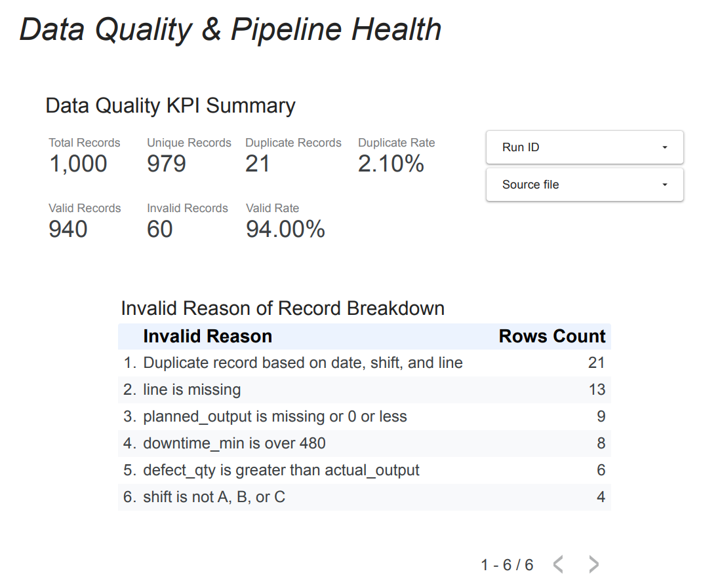
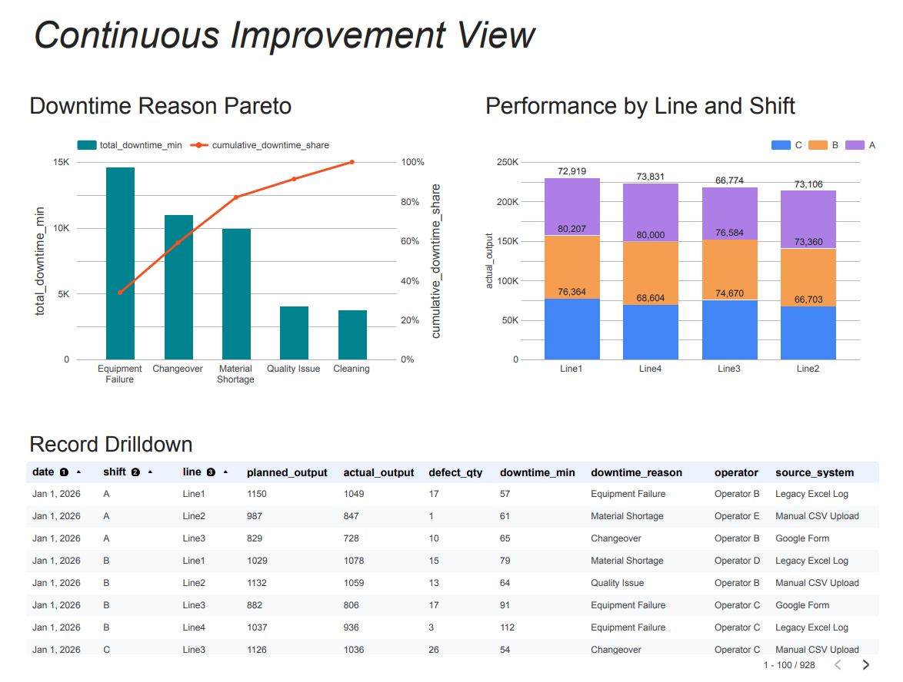
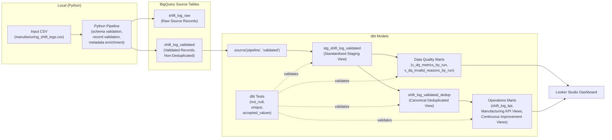

# Manufacturing Operations Data Quality & Performance Monitoring Platform

Operational Excellence case study demonstrating how raw operational records can be transformed into trusted datasets and decision-support dashboards through automated data-quality controls, KPI analytics, and monitoring workflows.


## Table of Contents

- [Overview](#overview)
- [Demo (Dashboard & Output)](#demo-dashboard--output)
- [Pipeline Architecture](#pipeline-architecture)
- [Data Source & Schema](#data-source--schema)
  - [Expected CSV schema](#expected-csv-schema)
- [Data Model](#data-model)
- [Data Quality Controls](#data-quality-controls)
  - [File-Level Schema Validation](#file-level-schema-validation)
  - [Record-Level Data Validation](#record-level-data-validation)
  - [dbt Transformation & Testing](#dbt-transformation--testing)
- [Dashboard (Looker Studio)](#dashboard-looker-studio)
- [CI (GitHub Actions)](#ci-github-actions)
  - [Steps](#steps)
  - [Authentication](#authentication)
- [Repo Structure](#repo-structure)
- [Setup](#setup)
  - [Quick Start (No GCP Setup Required)](#quick-start-no-gcp-setup-required)
  - [Alternative Setup (CLI / Native Environment)](#alternative-setup-cli--native-environment)
  - [Requirements](#requirements)
  - [Install Python dependencies](#install-python-dependencies)
  - [Environment Variables](#environment-variables)
  - [Run](#run)
  - [How to create BigQuery Views](#how-to-create-bigquery-views)


## Overview

This project simulates a digitalized manufacturing shift-log process and demonstrates an end-to-end data engineering workflow for operational analytics.

The workflow ingests manually collected production records, applies automated validation and quality controls, transforms the data into analytics-ready datasets, and delivers KPI dashboards for performance monitoring, root-cause analysis, and continuous improvement.

Key focus areas include:

- Data quality validation and governance
- Reproducible data pipelines
- KPI generation and monitoring
- Interactive dashboards and drill-down analytics
- Decision-support reporting

Tech Stack:


## Demo (Dashboard & Output)



- [Output PDF](docs/Production_Performance_Tracking.pdf)
- [Looker Studio dashboard](https://datastudio.google.com/reporting/566375cb-627a-4bd2-8376-72c78ed832a9)


## Pipeline Architecture

CSV → Python Ingestion & Validation → BigQuery Source Tables → dbt Governed Models → Looker Studio Dashboard

- Ingestion inputs: a local CSV file
- Python processing: schema validation, record-level validation, metadata enrichment, and BigQuery loading
- BigQuery source tables: raw and validated records generated by the Python pipeline
- dbt transformations: staging, deduplication, data quality marts, and operational KPI marts
- Reporting: Looker Studio dashboard built on dbt-managed analytical views





## Data Source & Schema
- Default source in this repository: synthetic manufacturing shift log records generated for demonstration purposes (`data/input/sample_manufacturing_shift_logs.csv`)
- The pipeline can process real-world manufacturing shift log data as long as it follows the same CSV schema.
- The sample dataset simulates production shift logs collected from common operational sources such as spreadsheets, manual CSV uploads, and online forms.

### Expected CSV schema
Columns expected in the input CSV:

- `date` (Production date. Type: DATE or STRING in `YYYY-MM-DD` format) (REQUIRED)
- `shift` (Production shift. Type: STRING; accepted values: `A`, `B`, `C`) (REQUIRED)
- `line` (Production line identifier. Type: STRING; e.g., `Line1`, `Line2`) (REQUIRED)
- `planned_output` (Planned production quantity for the shift. Type: INT64 or numeric STRING) (REQUIRED)
- `actual_output` (Actual production quantity for the shift. Type: INT64 or numeric STRING) (REQUIRED)
- `defect_qty` (Number of defective units produced during the shift. Type: INT64 or numeric STRING) (REQUIRED)
- `downtime_min` (Total downtime during the shift in minutes. Type: INT64 or numeric STRING) (REQUIRED)
- `downtime_reason` (Primary reason for downtime. Type: STRING; e.g., `Equipment Failure`, `Material Shortage`, `Changeover`, `Cleaning`, `Quality Issue`, `No Downtime`) (OPTIONAL)
- `operator` (Operator or shift owner. Type: STRING) (OPTIONAL)
- `source_system` (Source of the shift log record. Type: STRING; e.g., `Google Form`, `Manual CSV Upload`, `Legacy Excel Log`) (OPTIONAL)


## Data Model

This project follows a layered data architecture that separates ingestion, validation, governed transformation, and analytics marts.

1. **shift_log_raw**
   - Raw source records loaded by the Python pipeline
   - Stores original source values with ingestion metadata
   - No business validation or KPI calculation is applied

2. **shift_log_validated**
   - Python-generated validated records
   - Contains both valid and invalid records for data quality monitoring
   - Adds normalized fields, parsed numeric fields, validation metadata, duplicate flags, and deterministic business keys

3. **stg_shift_log_validated**
   - dbt-managed staging view over `shift_log_validated`
   - Standardizes column names for downstream models
   - Provides the common dbt entry point for deduplication, data quality marts, and KPI marts

4. **shift_log_validated_dedup**
   - dbt-managed canonical deduplicated view
   - Keeps only the latest valid record per `shift_log_id`
   - Uses ingestion metadata such as `ingested_at` and `row_id` to select the canonical record

5. **Data Quality Marts**
   - dbt-managed views for pipeline health and data quality monitoring
   - Includes summary metrics by pipeline run and invalid reason breakdowns
   - Built from non-deduplicated validated records to preserve visibility into invalid and duplicate records

6. **Operations Marts**
   - dbt-managed views for manufacturing KPI and continuous improvement analysis
   - Includes production achievement, defect rate, downtime rate, daily trends, line/shift comparisons, downtime Pareto analysis, and record-level drilldown
   - Built from valid, deduplicated records

Note: Table names are generated dynamically using a configurable prefix
and can be modified via `config/settings.py`.

[Tables Detail](docs/data_dictionary.md)

[ER Diagram](docs/er_diagram.md)


## Data Quality Controls

Data quality is enforced at two levels:

- **Python validation** handles file-level schema validation, record-level parsing, normalization, business-rule validation, duplicate flagging, and metadata enrichment before loading records into BigQuery.
- **dbt tests** validate the structure and expected grain of warehouse models, including not-null checks, uniqueness checks, and accepted-value checks for dashboard-facing datasets.

### File-Level Schema Validation

Before processing any records, the pipeline validates the input CSV schema.

Required columns:

- date
- shift
- line
- planned_output
- actual_output
- defect_qty
- downtime_min

Validation behavior:

- Missing required columns: pipeline fails immediately with a schema validation error.
- Missing optional columns: columns are automatically added with null values.
- Unexpected columns: accepted but logged as warnings.

This fail-fast validation prevents malformed input files from entering downstream processing and BigQuery storage.

### Record-Level Data Validation

After schema validation, records are normalized, validated, and enriched with data quality metadata.

#### Field Normalization

To improve resilience against common source data inconsistencies, key business fields are normalized before validation:

| Source Field | Normalized Field | Description |
|---|---|---|
| `date` | `production_date` | Parsed and normalized to `YYYY-MM-DD`. Multiple common input formats (e.g., `2026-01-01`, `2026/01/01`, `01.01.2026`) are supported. |
| `shift` | `shift_normalized` | Leading/trailing whitespace removed and values converted to uppercase. |
| `line` | `line_normalized` | Leading/trailing whitespace removed. |

Raw source values are preserved for auditability.

#### Numeric Parsing

Numeric source fields are parsed into typed columns while preserving the original source values.

| Source Field | Parsed Field |
|---|---|
| `planned_output` | `planned_output_int` |
| `actual_output` | `actual_output_int` |
| `defect_qty` | `defect_qty_int` |
| `downtime_min` | `downtime_min_int` |

If parsing fails, the parsed field is set to `NULL` and the validation process records the corresponding failure reason.

#### Validation Rules

| Category | Rule |
|---|---|
| Date validation | `production_date` must be successfully generated |
| Shift validation | `shift_normalized` must be one of `A`, `B`, or `C` |
| Line validation | `line_normalized` must not be empty |
| Numeric parsing | Parsed numeric fields must be successfully generated |
| Planned output | `planned_output_int` must be greater than 0 |
| Actual output | `actual_output_int` must be 0 or greater |
| Defect quantity | `defect_qty_int` must be 0 or greater and cannot exceed `actual_output_int` |
| Downtime | `downtime_min_int` must be between 0 and 480 minutes |
| Duplicate detection | Duplicate key is defined as `production_date + shift_normalized + line_normalized` |

#### Business Key Generation

`shift_log_id` is generated using a deterministic UUID v5 based on the normalized business key:

```text
production_date + shift_normalized + line_normalized
```

The ID is generated only when all business key fields are valid. Records with invalid business key fields retain a NULL shift_log_id.

#### Validation Metadata

Each record is enriched with validation metadata:

- `is_valid`
- `invalid_reason`
- `is_duplicate`

Duplicate records are retained rather than removed. This preserves ingestion traceability and supports downstream auditability while allowing governed views to select canonical records.

Invalid reasons are deduplicated and sorted to keep validation output deterministic and easier to audit.


<br/>

### dbt Transformation & Testing

This project uses dbt to manage warehouse-side transformations, analytical marts, documentation, and basic data quality tests.

**dbt run**
- Builds the staging model over the Python-generated validated table
- Builds the canonical deduplicated view
- Builds data quality marts for pipeline health monitoring
- Builds operations marts for manufacturing KPI and continuous improvement dashboards

**dbt test**
- Verifies key columns are not null
- Verifies uniqueness at the correct model grain, such as `shift_log_id` in the deduplicated model
- Verifies accepted values for shift codes
- Validates dashboard-facing models with basic schema tests

The dbt layer separates warehouse transformations from Python ingestion logic and provides a documented lineage from source tables to dashboard-ready marts.


## Dashboard (Looker Studio)


The final reporting layer is built in Looker Studio using the curated `shift_log_validated_dedup` view.

The dashboard consists of three pages designed for different stakeholder needs, from data engineers monitoring pipeline health to manufacturing managers analyzing production performance and improvement opportunities.

### Page 1: Data Quality & Pipeline Health

Provides visibility into data quality and ingestion health across pipeline runs.

Visualizations:
- Data quality KPI summary cards
- Invalid reason breakdown
- Filters by pipeline run and source file

This page helps identify data quality issues before records are consumed by downstream analytics. 

### Page 2: Manufacturing KPI

Provides an operational overview of production performance.

Visualizations:
- Daily production trend analysis
- KPI comparison by production line
- KPI comparison by shift

This page enables manufacturing managers to monitor production efficiency, quality performance, and operational availability. 

### Page 3: Continuous Improvement View

Supports root-cause analysis and continuous improvement initiatives.

Visualizations:
- Downtime reason Pareto chart
- Production performance by line and shift
- Detailed record drill-down table

The Pareto analysis helps identify the small number of downtime causes responsible for the majority of production losses, while the drill-down view allows users to investigate individual shift records and operational events.

- [Sample Report](docs/Production_Performance_Tracking.pdf)
- [Dashboard link](https://datastudio.google.com/s/mQRpiccUuZI)

<br/>

## CI (GitHub Actions)
This repository includes a lightweight CI workflow using GitHub Actions.

### Triggers

Manual execution (via workflow_dispatch) is supported. Scheduled runs are currently disabled to save BigQuery costs.

### Steps
- Runs unit tests (`pytest`)
- Executes the pipeline only if tests pass
- Loads processed records into BigQuery (demo mode uses `WRITE_MODE=TRUNCATE` to avoid accumulating data in the sandbox)
- Rebuilds KPI views by executing sql files and dbt run for monitoring dashboards


### Authentication

Uses a GCP service account via GitHub Secrets.

Note: For production, prefer Workload Identity Federation (OIDC) instead of long-lived service account keys.


## Repo Structure
```text
.
├── README.md
├── config
│   ├── __init__.py
│   └── settings.py    # Non-sensitive application settings and constants
├── credentials
├── data
│   ├── input          # place the input file here
│   │   └── sample_manufacturing_shift_logs.csv
│   └── output         # Used for debugging and local development.  
|                      # Outputs CSV files when the run parameter is set to "--output local".
├── docs
│   ├── data_dictionary.md
│   ├── er_diagram.md
|   └── Production_Performance_Tracking.pdf # sample dashboard pdf
├── requirements.txt
├── sql
│   ├── 10_views_dq_kpi.sql      # sql for creating DQ views
│   └── 11_views_ops_kpi.sql  # sql for creating manufacturing KPI views
├── src
│   ├── __init__.py
│   └── manufacturing_ops    # Pipeline modules for ingestion, validation, transformation, and output
│       ├── __init__.py
│       ├── main.py          # Entry point for the pipeline
│       ├── pipeline         # Pipeline orchestration
│       ├── ingestion        # Data ingestion module
│       ├── output           # BigQuery loading module
│       ├── transformation   # Data transformation
│       ├── validation       # Data quality validation
│       ├── apply_sql.py     # Creates BigQuery views for Looker Studio
│       └── generate_sample_manufacturing_shift_logs.py     # Creates sample input file
├── tests
```

<br/>

## Setup

### Quick Start (No GCP Setup Required)

Use the sample input file to run the pipeline locally in a Docker container. The generated raw and validated outputs will be saved to `data/output/`.

```bash
make
```

### Alternative Setup (CLI / Native Environment)
If you want to use BigQuery output using your own input file, follow the steps below to set up a local environment.


### Requirements
- Python 3.12 or later

- A Google Cloud project with a BigQuery dataset configured


### Install Python dependencies
Create a virtual environment and install the required packages:

``` bash
python -m venv venv
source venv/bin/activate
pip install --upgrade pip
pip install -r requirements.txt
```


### Environment Variables
Copy .env.example to .env, then configure the following variables:

`UUID_STRING` – Used to generate a consistent `shift_log_id` for identical shift log record across different pipeline runs.
Generate one by running:

``` bash
uuidgen
```

`PROJECT_ID` – Your BigQuery project ID.

`DATASET_ID` – Your BigQuery dataset ID.

`TABLE_PREFIX` - Prefix for the output tables.

`GOOGLE_APPLICATION_CREDENTIALS` – Path to your Google Cloud service account key JSON file (set either in your system environment or in .env).


⚠️ Do not commit your service account key file to the repository.


### Run

The pipeline supports two output destinations: BigQuery and local files.

1. Place the input CSV file in `data/input/`.

2. (BigQuery): To load raw and validated records into BigQuery, run:

```bash
python -m src.manufacturing_ops.main \
  --input-file data/input/<filename>.csv \
  --output bigquery
```

2. (Local): To write raw and validated records to local files in data/output/, run:

```bash
python -m src.manufacturing_ops.main \
  --input-file data/input/<filename>.csv \
  --output local
```

(For the required file schema, see [here](#expected-csv-schema)).

### How to create BigQuery Views
#### 1. Create the 'shift_log_validated_dedup' view with dbt
Before running dbt, load the environment variables and install the required packages:

```bash
export $(grep -v '^#' .env | xargs)
dbt deps --project-dir dbt_manufacturing_ops
```
Then run the following command to create the `shift_log_validated_dedup` view in BigQuery:

```bash
dbt run --project-dir dbt_manufacturing_ops --profiles-dir dbt_manufacturing_ops
```

#### 2. Create the remaining views
After creating the `shift_log_validated_dedup` view, run the command below to create the remaining views:

```bash
python -m src.manufacturing_ops.apply_sql
```


#### 3. (Optional) Run dbt Tests

The deduplicated view can also be validated with dbt tests:

```bash
dbt test --project-dir dbt_manufacturing_ops --profiles-dir dbt_manufacturing_ops
```
