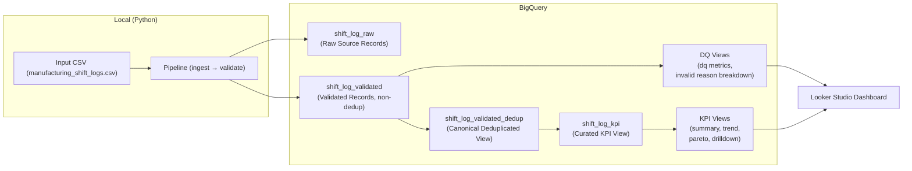

# Manufacturing Operations Data Quality & Performance Monitoring Platform

This project is designed as a practical Operational Excellence digitalization case study. It demonstrates how manually collected manufacturing shift-log data can be transformed into governed operational data, validated automatically, and visualized through KPI dashboards for production performance tracking and continuous improvement.


## Table of Contents

- [Overview](#overview)
- [Demo (Dashboard & Output)](#demo-dashboard--output)
- [Pipeline Architecture](#pipeline-architecture)
- [Data Governance & Master Data Relevance](#data-governance--master-data-relevance)
- [Data Source & Schema](#data-source--schema)
  - [Expected CSV schema](#expected-csv-schema)
- [Data Model](#data-model)
- [Data Quality & Validation](#data-quality--validation)
  - [dbt migration](#dbt-migration)
- [Dashboard (Looker Studio)](#dashboard-looker-studio)
- [CI (GitHub Actions)](#ci-github-actions)
  - [Steps](#steps)
  - [Authentication](#authentication)
- [Repo Structure](#repo-structure)
- [Setup](#setup)
  - [Quick Start (Recommended)](#quick-start-recommended)
  - [Alternative Setup (CLI / Native Environment)](#alternative-setup-cli--native-environment)
  - [Requirements](#requirements)
  - [Install Python dependencies](#install-python-dependencies)
  - [Environment Variables](#environment-variables)
  - [Run](#run)
  - [How to create BigQuery View](#how-to-create-bigquery-view)


## Overview

The workflow simulates a digitalized manufacturing shift-log process and converts raw production records into validated, curated, and dashboard-ready operational data.

Tech Stack:


## Demo (Dashboard & Output)


- [Output PDF](docs/Production_Performance_Tracking.pdf)
- [Looker Studio dashboard](https://datastudio.google.com/reporting/566375cb-627a-4bd2-8376-72c78ed832a9)


## Pipeline Architecture

CSV → Ingestion & Validation Pipeline → BigQuery Governed Layers → Monitoring & BI

- Ingestion inputs: a local CSV file 
- Processing: Python scripts
- Storage: 2 tables + 1 dedup-view ([see Data Model section](#data-model))
- BI: Looker Studio (Data Quality KPI, Operational KPI, Continuous Improvement KPI)




## Data Source & Schema
- Default source in this repo: Synthetic manufacturing shift log records (`data/input/sample_manufacturing_shift_logs.csv`)
- The pipeline works with real-world shift log data as long as it follows the same CSV schema.
- The input data simulates manually collected or spreadsheet-based production shift logs.

### Expected CSV schema
Columns expected in the input CSV:

- `date` (Production date. Type: DATE or STRING in `YYYY-MM-DD` format) (REQUIRED)
- `shift` (Production shift. Type: STRING; accepted values: `A`, `B`, `C`) (REQUIRED)
- `line` (Production line identifier. Type: STRING; e.g., `Line1`, `Line2`) (REQUIRED)
- `planned_output` (Planned production quantity for the shift. Type: INT64 or numeric STRING) (REQUIRED)
- `actual_output` (Actual production quantity for the shift. Type: INT64 or numeric STRING) (REQUIRED)
- `defect_qty` (Number of defective units produced during the shift. Type: INT64 or numeric STRING) (REQUIRED)
- `downtime_min` (Total downtime during the shift in minutes. Type: INT64 or numeric STRING) (REQUIRED)
- `downtime_reason` (Primary reason for downtime. Type: STRING; e.g., `Equipment Failure`, `Material Shortage`, `Changeover`, `Cleaning`, `Quality Issue`, `No Downtime`) (OPTIONAL)
- `operator` (Operator or shift owner. Type: STRING) (OPTIONAL)
- `source_system` (Source of the shift log record. Type: STRING; e.g., `Google Form`, `Manual CSV Upload`, `Legacy Excel Log`) (OPTIONAL)


## Data Model

This pipeline follows a layered data architecture:

1. **shift_log_raw**
   - Raw source records ingested from the input CSV
   - Stores source values with ingestion metadata
   - No business validation or KPI calculation is applied

2. **shift_log_validated**
   - Validated and type-normalized manufacturing shift log records
   - Contains both valid and invalid records for data quality monitoring
   - Adds validation fields such as `is_valid`, `invalid_reason`, and `is_duplicate`
   - Adds `shift_log_id`, a deterministic UUID v5 generated from `date`, `shift`, and `line` when these fields are available

3. **shift_log_validated_dedup (View)**
   - Deduplicated view of `shift_log_validated`
   - Keeps only the latest record per `shift_log_id`
   - Uses `ingested_at` to select the most recent record
   - Used as the governed record layer for downstream KPI generation

4. **shift_log_kpi (View)**
   - Curated operational KPI table generated from valid, deduplicated records
   - Includes production achievement, defect rate, and downtime rate
   - Used for Looker Studio reporting and continuous improvement analysis

<br/>

Note: Table names are generated dynamically using a configurable prefix
and can be modified via `config/settings.py`.

[Tables Detail](docs/data_dictionary.md)

[ER Diagram](docs/er_diagram.md)


## Data Quality & Validation


Note: Records that do not pass the quality check are flagged as `is_valid = False` and excluded from downstream processing. They can be monitored in the review_validated table.
<br/>

###  dbt migration

By dbt run:
- Create shift_log_validated_dedup view 

By dbt test:
- Check that `shift_log_id` is unique (no duplicates)
- Check that `date`, `line` is not NULL
- Check that `shift` is in ['A', 'B', 'C']


## Dashboard (Looker Studio)

- [Sample pdf Report (dummy customer feedback records for a hotel)](docs/Report_on_Negative_Review_Reasons.pdf)
- [Dashboard link](https://lookerstudio.google.com/reporting/a6186eaf-dfec-409e-91ba-79826297d478)


### Page 1: Data Quality / Pipeline Health
Shows ingestion volume, deduplication impact (total vs unique), valid/invalid rates, and breakdowns for duplicate groups and invalid reasons.


### Page 2: Extracted Reasons Insights
Shows top entities & issue categories, and the entity × issue_category heatmap based on the canonical (top-confidence) reason per review.

### Page 3: Drilldown / Record Explorer
Allows filtering by run and drilling down to validated records and extracted reasons for auditing/debugging.


<br/>

## CI (GitHub Actions)
This repository includes a lightweight CI workflow using GitHub Actions.

### Triggers

Manual run (workflow_dispatch), and
Scheduled run (daily cron).

### Steps
- Runs unit tests (`pytest`)
- Executes the pipeline only if tests pass
- Loads processed records into BigQuery (demo mode uses `WRITE_MODE=TRUNCATE` to avoid accumulating data in the sandbox)
- Rebuilds reporting views for monitoring dashboards


### Authentication

Uses a GCP service account via GitHub Secrets.

Note: For production, prefer Workload Identity Federation (OIDC) instead of long-lived service account keys.


## Repo Structure
```text
.
├── README.md
├── config
│   ├── __init__.py
│   └── settings.py    # Non-sensitive application settings and constants
├── credentials
├── data
│   ├── input          # place the file here you'd like to analyze
│   │   └── sample_hotel_reviews.csv
│   └── output         # Used for debugging and local development.  
|                      # Outputs a CSV file when the run parameter is set to "--output local".
├── dics
│   ├── entity_lexicon.csv    # for categorizing entity
│   ├── issue_lexicon.csv     # for categorizing issue
│   └── sentiment_lexicon.csv # for detecting a polarity term
├── docs
│   ├── data_dictionary.md
│   ├── er_diagram.md
│   ├── extraction_rules.md
|   └── Report_on_Negative_Review_Reasons.pdf # sample report for hotel customer feedback records (used only dummy data)
├── requirements.txt
├── sql
│   ├── 10_views_dq.sql      # sql for creating DQ views
│   └── 11_views_kpi_reasons.sql  # sql for creating KPI Reason views
├── src
│   ├── __init__.py
│   └── reason_extraction    # Pipeline modules for ingestion, validation, transformation, and analytical enrichment
│       ├── __init__.py
│       ├── main.py          # Entry point for the extraction pipeline
│       ├── apply_sql.py     # Creates BigQuery views for Looker Studio
│       ├── extraction       # Review reason extraction logic
│       ├── ingestion        # Data ingestion module
│       ├── output           # BigQuery loading module
│       ├── pipeline         # Pipeline orchestration
│       ├── preprocessing    # Data preprocessing
│       ├── transformation   # Data transformation
│       └── validation       # Data quality validation
├── tests
```

<br/>

## Setup

### Quick Start (Recommended)

Run the pipeline locally in a Docker container with the command below. No GCP setup is required.

```bash
make
```


### Alternative Setup (CLI / Native Environment)
If you prefer to run the project without Docker, or want to use BigQuery output, follow the steps below to set up a local environment.


### Requirements
- Python 3.12 or later

- A Google Cloud project with a BigQuery dataset configured


### Install Python dependencies
Create a virtual environment and install the required packages:

``` bash
python -m venv venv
source venv/bin/activate
pip install --upgrade pip
pip install -r requirements.txt
```


### Environment Variables
Copy .env.example to .env, then configure the following variables:

`UUID_STRING` – Used to generate a consistent reason_id for identical review texts across different pipeline runs.
Generate one by running:

``` bash
uuidgen
```

`PROJECT_ID` – Your BigQuery project ID.

`DATASET_ID` – Your BigQuery dataset ID.

`TABLE_PREFIX` - Prefix for the output tables.

`GOOGLE_APPLICATION_CREDENTIALS` – Path to your Google Cloud service account key JSON file (set either in your system environment or in .env).


⚠️ Do not commit your service account key file to the repository.


### Run

Place the file you want to analyze in `data/input/`, then run the command below.

(For the required file schema, see [here](#expected-csv-schema)).
```
python -m src.reason_extraction.main \
  --input-file data/input/(your filename).csv  \
  --output bigquery
```

To output the analysis results to `data/output/` instead of BigQuery, run:
```
python -m src.reason_extraction.main \
  --input-file data/input/(your filename).csv  \
  --output local
```

### How to create BigQuery View
1. Create the 'shift_log_validated_dedup' view with dbt
Before running dbt, load the environment variables and install the required packages:
```
export $(grep -v '^#' .env | xargs)
dbt deps --project-dir ./review_insights
```
Then run the following command to create the `shift_log_validated_dedup` view in BigQuery:
```
dbt run --project-dir ./review_insights --profiles-dir ./review_insights/
```

