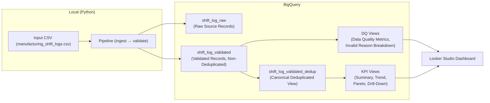

# Manufacturing Operations Data Quality & Performance Monitoring Platform

Operational Excellence case study demonstrating how raw operational records can be transformed into trusted datasets and decision-support dashboards through automated data-quality controls, KPI analytics, and monitoring workflows.


## Table of Contents

- [Overview](#overview)
- [Demo (Dashboard & Output)](#demo-dashboard--output)
- [Pipeline Architecture](#pipeline-architecture)
- [Data Source & Schema](#data-source--schema)
  - [Expected CSV schema](#expected-csv-schema)
- [Data Model](#data-model)
- [Data Quality & Validation](#data-quality--validation)
  - [dbt migration & Testing](#dbt-migration--testing)
- [Dashboard (Looker Studio)](#dashboard-looker-studio)
- [CI (GitHub Actions)](#ci-github-actions)
  - [Steps](#steps)
  - [Authentication](#authentication)
- [Repo Structure](#repo-structure)
- [Setup](#setup)
  - [Quick Start (No GCP Setup Required)](#quick-start-no-gcp-setup-required)
  - [Alternative Setup (CLI / Native Environment)](#alternative-setup-cli--native-environment)
  - [Requirements](#requirements)
  - [Install Python dependencies](#install-python-dependencies)
  - [Environment Variables](#environment-variables)
  - [Run](#run)
  - [How to create BigQuery Views](#how-to-create-bigquery-views)


## Overview

This project simulates a digitalized manufacturing shift-log process and demonstrates an end-to-end data engineering workflow for operational analytics.

The workflow ingests manually collected production records, applies automated validation and quality controls, transforms the data into analytics-ready datasets, and delivers KPI dashboards for performance monitoring, root-cause analysis, and continuous improvement.

Key focus areas include:

- Data quality validation and governance
- Reproducible data pipelines
- KPI generation and monitoring
- Interactive dashboards and drill-down analytics
- Decision-support reporting

Tech Stack:


## Demo (Dashboard & Output)


- [Output PDF](docs/Production_Performance_Tracking.pdf)
- [Looker Studio dashboard](https://datastudio.google.com/reporting/566375cb-627a-4bd2-8376-72c78ed832a9)


## Pipeline Architecture

CSV → Python Validation Pipeline → BigQuery Governed Layers → Looker Studio Dashboard

- Ingestion inputs: a local CSV file 
- Processing: Python-based ingestion and validation pipeline
- Storage: 2 BigQuery tables and 1 deduplicated view ([see Data Model section](#data-model))
- Reporting: Looker Studio (Data Quality KPIs, Manufacturing KPIs, Continuous Improvement Analysis)




## Data Source & Schema
- Default source in this repository: synthetic manufacturing shift log records generated for demonstration purposes (`data/input/sample_manufacturing_shift_logs.csv`)
- The pipeline can process real-world manufacturing shift log data as long as it follows the same CSV schema.
- The sample dataset simulates production shift logs collected from common operational sources such as spreadsheets, manual CSV uploads, and online forms.

### Expected CSV schema
Columns expected in the input CSV:

- `date` (Production date. Type: DATE or STRING in `YYYY-MM-DD` format) (REQUIRED)
- `shift` (Production shift. Type: STRING; accepted values: `A`, `B`, `C`) (REQUIRED)
- `line` (Production line identifier. Type: STRING; e.g., `Line1`, `Line2`) (REQUIRED)
- `planned_output` (Planned production quantity for the shift. Type: INT64 or numeric STRING) (REQUIRED)
- `actual_output` (Actual production quantity for the shift. Type: INT64 or numeric STRING) (REQUIRED)
- `defect_qty` (Number of defective units produced during the shift. Type: INT64 or numeric STRING) (REQUIRED)
- `downtime_min` (Total downtime during the shift in minutes. Type: INT64 or numeric STRING) (REQUIRED)
- `downtime_reason` (Primary reason for downtime. Type: STRING; e.g., `Equipment Failure`, `Material Shortage`, `Changeover`, `Cleaning`, `Quality Issue`, `No Downtime`) (OPTIONAL)
- `operator` (Operator or shift owner. Type: STRING) (OPTIONAL)
- `source_system` (Source of the shift log record. Type: STRING; e.g., `Google Form`, `Manual CSV Upload`, `Legacy Excel Log`) (OPTIONAL)


## Data Model

This pipeline follows a layered data architecture:

1. **shift_log_raw**
   - Raw source records ingested from the input CSV
   - Stores source values with ingestion metadata
   - No business validation or KPI calculation is applied

2. **shift_log_validated**
   - Validated and type-normalized manufacturing shift log records
   - Contains both valid and invalid records for data quality monitoring
   - Adds validation fields such as `is_valid`, `invalid_reason`, and `is_duplicate`
   - Adds `shift_log_id`, a deterministic UUID v5 generated from `date`, `shift`, and `line` when these fields are available

3. **shift_log_validated_dedup (View)**
   - Deduplicated view of `shift_log_validated`
   - Keeps only the latest record per `shift_log_id`
   - Uses `ingested_at` and `row_id` to select the most recent record
   - Used as the governed record layer for downstream KPI generation


<br/>

Note: Table names are generated dynamically using a configurable prefix
and can be modified via `config/settings.py`.

[Tables Detail](docs/data_dictionary.md)

[ER Diagram](docs/er_diagram.md)


## Data Quality & Validation

The validation layer applies schema checks and business rules before records are promoted from the raw ingestion layer to downstream curated data.

Each record is enriched with validation metadata:

- `is_valid`: indicates whether the record passed all validation checks
- `invalid_reason`: stores one or more validation failure reasons
- `is_duplicate`: flags duplicate records based on the business key

Validation rules include:

| Category | Rule |
|---|---|
| Date validation | `date` must exist and be parseable into `date_iso` |
| Timezone validation | `date_iso` must be timezone-aware and normalized to UTC |
| Duplicate detection | Duplicate key is defined as `date + shift + line` |
| Shift validation | `shift` must be one of `A`, `B`, or `C` |
| Line validation | `line` must not be empty |
| Numeric parsing | `planned_output`, `actual_output`, `defect_qty`, and `downtime_min` must be valid integers |
| Planned output | `planned_output` must be greater than 0 |
| Actual output | `actual_output` must be 0 or greater |
| Defect quantity | `defect_qty` must be 0 or greater and cannot exceed `actual_output` |
| Downtime | `downtime_min` must be between 0 and 480 minutes |

If a record fails date validation, `shift_log_id` is set to `None`. This prevents inconsistent date formats from generating unstable business keys.

Duplicate records are not dropped at the validation stage. Instead, they are retained with `is_valid = False`, `is_duplicate = True`, and an explanatory reason in `invalid_reason`. This preserves full ingestion traceability while allowing downstream views to select canonical records.

Invalid reasons are deduplicated and sorted to keep validation output deterministic and easier to audit.


<br/>

### dbt Migration & Testing

This project uses dbt for both data transformation and data quality validation.

**dbt run**
- Create the `shift_log_validated_dedup` view
- Materialize the latest canonical record per `shift_log_id`

**dbt test**
- Verify `shift_log_id` is unique
- Verify `date` is not NULL
- Verify `line` is not NULL
- Verify `shift` contains only valid values (`A`, `B`, `C`)


## Dashboard (Looker Studio)


The final reporting layer is built in Looker Studio using the curated `shift_log_validated_dedup` view.

The dashboard consists of three pages designed for different stakeholder needs, from data engineers monitoring pipeline health to manufacturing managers analyzing production performance and improvement opportunities.

### Page 1: Data Quality & Pipeline Health

Provides visibility into data quality and ingestion health across pipeline runs.

Visualizations:
- Data quality KPI summary cards
- Invalid reason breakdown
- Filters by pipeline run and source file

This page helps identify data quality issues before records are consumed by downstream analytics. 

### Page 2: Manufacturing KPI

Provides an operational overview of production performance.

Visualizations:
- Daily production trend analysis
- KPI comparison by production line
- KPI comparison by shift

This page enables manufacturing managers to monitor production efficiency, quality performance, and operational availability. 

### Page 3: Continuous Improvement View

Supports root-cause analysis and continuous improvement initiatives.

Visualizations:
- Downtime reason Pareto chart
- Production performance by line and shift
- Detailed record drill-down table

The Pareto analysis helps identify the small number of downtime causes responsible for the majority of production losses, while the drill-down view allows users to investigate individual shift records and operational events.

- [Sample Report](docs/Production_Performance_Tracking.pdf)
- [Dashboard link](https://datastudio.google.com/s/mQRpiccUuZI)

<br/>

## CI (GitHub Actions)
This repository includes a lightweight CI workflow using GitHub Actions.

### Triggers

Manual execution (via workflow_dispatch) is supported. Scheduled runs are currently disabled to save BigQuery costs.

### Steps
- Runs unit tests (`pytest`)
- Executes the pipeline only if tests pass
- Loads processed records into BigQuery (demo mode uses `WRITE_MODE=TRUNCATE` to avoid accumulating data in the sandbox)
- Rebuilds KPI views by executing sql files and dbt run for monitoring dashboards


### Authentication

Uses a GCP service account via GitHub Secrets.

Note: For production, prefer Workload Identity Federation (OIDC) instead of long-lived service account keys.


## Repo Structure
```text
.
├── README.md
├── config
│   ├── __init__.py
│   └── settings.py    # Non-sensitive application settings and constants
├── credentials
├── data
│   ├── input          # place the input file here
│   │   └── sample_manufacturing_shift_logs.csv
│   └── output         # Used for debugging and local development.  
|                      # Outputs CSV files when the run parameter is set to "--output local".
├── docs
│   ├── data_dictionary.md
│   ├── er_diagram.md
|   └── Production_Performance_Tracking.pdf # sample dashboard pdf
├── requirements.txt
├── sql
│   ├── 10_views_dq_kpi.sql      # sql for creating DQ views
│   └── 11_views_ops_kpi.sql  # sql for creating manufacturing KPI views
├── src
│   ├── __init__.py
│   └── manufacturing_ops    # Pipeline modules for ingestion, validation, transformation, and output
│       ├── __init__.py
│       ├── main.py          # Entry point for the pipeline
│       ├── pipeline         # Pipeline orchestration
│       ├── ingestion        # Data ingestion module
│       ├── output           # BigQuery loading module
│       ├── transformation   # Data transformation
│       ├── validation       # Data quality validation
│       ├── apply_sql.py     # Creates BigQuery views for Looker Studio
│       └── generate_sample_manufacturing_shift_logs.py     # Creates sample input file
├── tests
```

<br/>

## Setup

### Quick Start (No GCP Setup Required)

Use the sample input file to run the pipeline locally in a Docker container. The generated raw and validated outputs will be saved to `data/output/`.

```bash
make
```

### Alternative Setup (CLI / Native Environment)
If you want to use BigQuery output using your own input file, follow the steps below to set up a local environment.


### Requirements
- Python 3.12 or later

- A Google Cloud project with a BigQuery dataset configured


### Install Python dependencies
Create a virtual environment and install the required packages:

``` bash
python -m venv venv
source venv/bin/activate
pip install --upgrade pip
pip install -r requirements.txt
```


### Environment Variables
Copy .env.example to .env, then configure the following variables:

`UUID_STRING` – Used to generate a consistent `shift_log_id` for identical shift log record across different pipeline runs.
Generate one by running:

``` bash
uuidgen
```

`PROJECT_ID` – Your BigQuery project ID.

`DATASET_ID` – Your BigQuery dataset ID.

`TABLE_PREFIX` - Prefix for the output tables.

`GOOGLE_APPLICATION_CREDENTIALS` – Path to your Google Cloud service account key JSON file (set either in your system environment or in .env).


⚠️ Do not commit your service account key file to the repository.


### Run

The pipeline supports two output destinations: BigQuery and local files.

1. Place the input CSV file in `data/input/`.

2. (BigQuery): To load raw and validated records into BigQuery, run:

```bash
python -m src.manufacturing_ops.main \
  --input-file data/input/<filename>.csv \
  --output bigquery
```

2. (Local): To write raw and validated records to local files in data/output/, run:

```bash
python -m src.manufacturing_ops.main \
  --input-file data/input/<filename>.csv \
  --output local
```

(For the required file schema, see [here](#expected-csv-schema)).

### How to create BigQuery Views
#### 1. Create the 'shift_log_validated_dedup' view with dbt
Before running dbt, load the environment variables and install the required packages:

```bash
export $(grep -v '^#' .env | xargs)
dbt deps --project-dir dbt_manufacturing_ops
```
Then run the following command to create the `shift_log_validated_dedup` view in BigQuery:

```bash
dbt run --project-dir dbt_manufacturing_ops --profiles-dir dbt_manufacturing_ops
```

#### 2. Create the remaining views
After creating the `shift_log_validated_dedup` view, run the command below to create the remaining views:

```bash
python -m src.dbt_manufacturing.apply_sql
```


#### 3. (Optional) Run dbt Tests

The deduplicated view can also be validated with dbt tests:

```bash
dbt test --project-dir dbt_manufacturing_ops --profiles-dir dbt_manufacturing_ops
```
