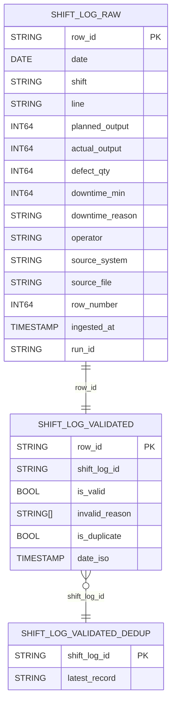

### Entity Relationship Diagram

```mermaid
erDiagram

    SHIFT_LOG_RAW ||--|| SHIFT_LOG_VALIDATED : "row_id"

    SHIFT_LOG_VALIDATED }o--|| SHIFT_LOG_VALIDATED_DEDUP : "shift_log_id"

    SHIFT_LOG_RAW {
        STRING row_id PK
        DATE date
        STRING shift
        STRING line
        INT64 planned_output
        INT64 actual_output
        INT64 defect_qty
        INT64 downtime_min
        STRING downtime_reason
        STRING operator
        STRING source_system
        STRING source_file
        INT64 row_number
        TIMESTAMP ingested_at
        STRING run_id
    }

    SHIFT_LOG_VALIDATED {
        STRING row_id PK
        STRING shift_log_id
        BOOL is_valid
        STRING[] invalid_reason
        BOOL is_duplicate
        TIMESTAMP date_iso
    }

    SHIFT_LOG_VALIDATED_DEDUP {
        STRING shift_log_id PK
        STRING latest_record
    }
```